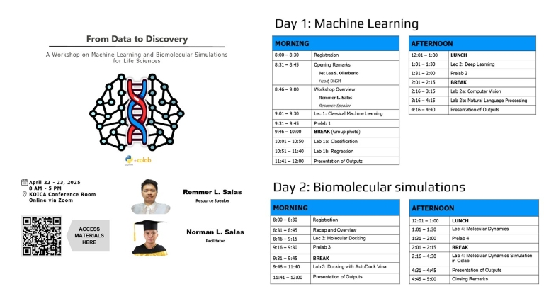

### From Data to Discovery: A Workshop on Machine Learning and Biomolecular Simulations for Life Sciences

#### 📚 Lecture Slides
- [Lecture 1: Classical machine learning](Lecture_slides/Lec_1_Classical_ML.pptx)
- [Lecture 2: Deep learning](Lecture_slides/Lec_2_Deep_learning.pptx)
- [Lecture 3: Molecular docking](Lecture_slides/Lec_3_Docking.pptx)
- [Lecture 4: Molecular dynamics](Lecture_slides/Lec_4_MD.pptx)

#### 🎥 Recordings
- [Lecture 1](https://youtu.be/cD3iqhRUv0s?si=rLl-9GBfWwLl8fpy)
- [Lecture 2](https://youtu.be/2ls_3C5HpYc?si=FyKCI8J7Vu22m5yM)
- [Lecture 3](https://youtu.be/2ls_3C5HpYc?si=YVYDsI0m_1BjxTdy)
- [Lecture 4]()
